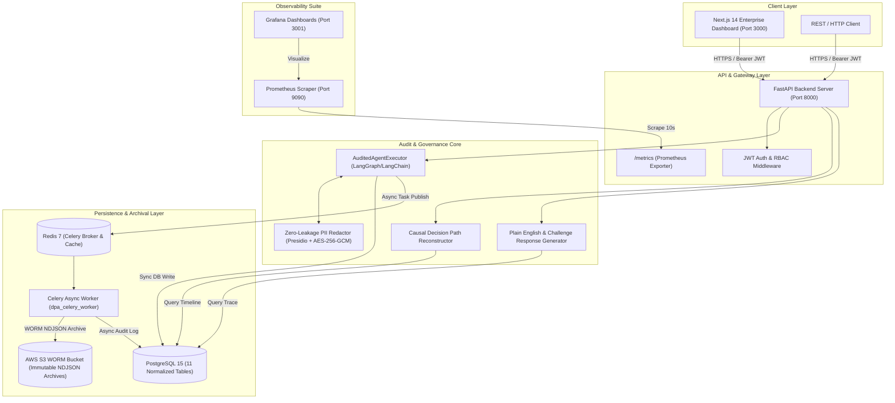

# Decision Path Auditor — Technical Architecture Guide

## 1. High-Level Architectural Diagram

## 2. 13-Point Causal Chain Ingestion Pipeline
When an AI agent executes (`POST /api/v1/run-agent`), the **AuditedAgentExecutor** captures 13 distinct causal parameters:
1. `user_id`: Authenticated user or applicant ID.
2. `session_id`: Unique audit session UUID.
3. `input_text`: Raw prompt submitted to the agent.
4. `redacted_input`: Scrubbed prompt with PII tokens replaced by `<REDACTED_ENTITY>`.
5. `retrieved_contexts`: Ordered citations with similarity scores and rank order.
6. `tool_calls`: Sequential list of executed tools, parameters, outputs, latency (ms), and retries.
7. `reasoning_steps`: Ordered intermediate thoughts (summarized if `legal_reasoning_redaction=True`).
8. `final_output`: Synthesized underwriting or operational determination.
9. `confidence_score`: Normalized probability (`0.0 - 1.0`).
10. `risk_level`: Assigned enterprise risk level (`low`, `medium`, `high`, `critical`).
11. `status`: Execution outcome (`success`, `error`, `timeout`).
12. `latency_ms`: Total end-to-end execution time in milliseconds.
13. `model_usage`: Complete token accounting (`prompt_tokens`, `completion_tokens`, `total_tokens`, `estimated_cost_usd`).

## 3. Storage & WORM Archival Strategy
- **PostgreSQL 15**: Relational persistence across 11 normalized tables ensuring foreign-key integrity between `AgentRun` and its child events (`ToolCall`, `ReasoningStep`, `RetrievedContext`, `PIIRedaction`, `ModelUsage`, `DecisionSummary`).
- **AWS S3 WORM Archival**: Celery background workers serialize the complete trace envelope into an immutable Newline-Delimited JSON (`.jsonl`) file stored in an S3 bucket with Object Lock enabled (`s3://dpa-enterprise-audit-traces-<env>/traces/<session_id>/<run_id>.jsonl`).
