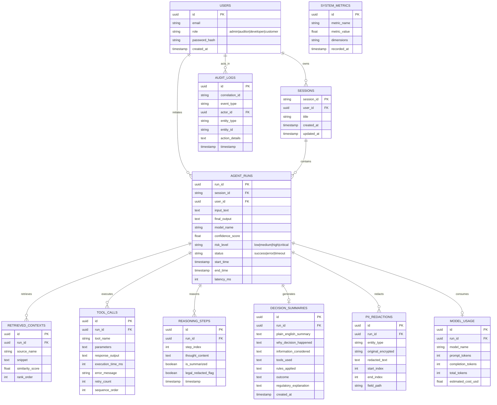

# Decision Path Auditor — Entity-Relationship (ER) Diagram & Database Dictionary

## 1. Complete 11-Table ER Diagram

## 2. Table Definitions & Compliance Notes
- **`agent_runs`**: Represents an individual atomic AI Agent invocation. Maintains foreign keys to both `users` and `sessions`.
- **`pii_redactions`**: Stores sensitive PII tokens identified by Microsoft Presidio. `original_encrypted` holds the `AES-256-GCM` base64 ciphertext; `redacted_text` holds `<REDACTED_ENTITY>`.
- **`reasoning_steps`**: Captures intermediate thought chains. If `legal_redacted_flag=True`, `thought_content` contains an auditable non-proprietary summary while preserving sequence indexes (`step_index`).
- **`decision_summaries`**: Contains 5-part customer plain English summaries (`why_decision_happened`, `information_considered`, `tools_used`, `rules_applied`, `outcome`) and formal regulatory challenge explanations.
