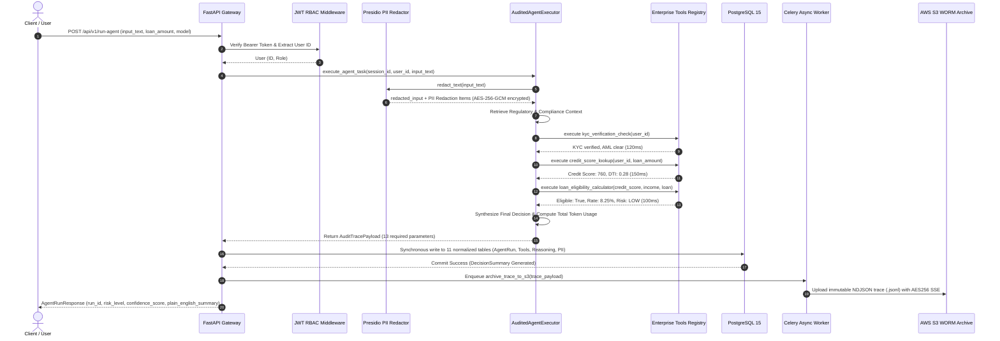
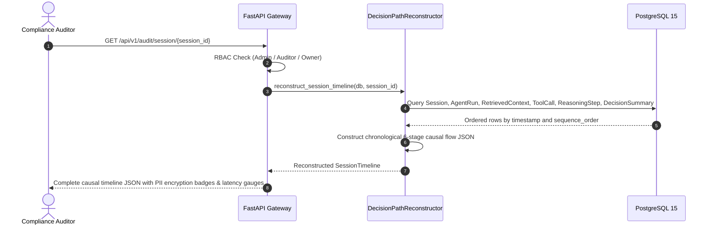

# Decision Path Auditor — Sequence Diagrams

## 1. End-to-End Audited AI Agent Execution (`POST /api/v1/run-agent`)

```mermaid
sequenceDiagram
    autonumber
    actor User as Client / User
    participant API as FastAPI Gateway
    participant Auth as JWT RBAC Middleware
    participant Redact as Presidio PII Redactor
    participant Exec as AuditedAgentExecutor
    participant Tools as Enterprise Tools Registry
    participant DB as PostgreSQL 15
    participant Worker as Celery Async Worker
    participant S3 as AWS S3 WORM Archive

    User->>API: POST /api/v1/run-agent (input_text, loan_amount, model)
    API->>Auth: Verify Bearer Token & Extract User ID
    Auth-->>API: User (ID, Role)
    
    API->>Exec: execute_agent_task(session_id, user_id, input_text)
    Exec->>Redact: redact_text(input_text)
    Redact-->>Exec: redacted_input + PII Redaction Items (AES-256-GCM encrypted)
    
    Exec->>Exec: Retrieve Regulatory & Compliance Context
    Exec->>Tools: execute kyc_verification_check(user_id)
    Tools-->>Exec: KYC verified, AML clear (120ms)
    
    Exec->>Tools: execute credit_score_lookup(user_id, loan_amount)
    Tools-->>Exec: Credit Score: 760, DTI: 0.28 (150ms)
    
    Exec->>Tools: execute loan_eligibility_calculator(credit_score, income, loan)
    Tools-->>Exec: Eligible: True, Rate: 8.25%, Risk: LOW (100ms)
    
    Exec->>Exec: Synthesize Final Decision & Compute Total Token Usage
    Exec-->>API: Return AuditTracePayload (13 required parameters)
    
    API->>DB: Synchronous write to 11 normalized tables (AgentRun, Tools, Reasoning, PII)
    DB-->>API: Commit Success (DecisionSummary Generated)
    
    API->>Worker: Enqueue archive_trace_to_s3(trace_payload)
    Worker->>S3: Upload immutable NDJSON trace (.jsonl) with AES256 SSE
    
    API-->>User: AgentRunResponse (run_id, risk_level, confidence_score, plain_english_summary)
```

## 2. Causal Timeline Reconstruction (`GET /api/v1/audit/session/{id}`)

```mermaid
sequenceDiagram
    autonumber
    actor Auditor as Compliance Auditor
    participant API as FastAPI Gateway
    participant Recon as DecisionPathReconstructor
    participant DB as PostgreSQL 15

    Auditor->>API: GET /api/v1/audit/session/{session_id}
    API->>API: RBAC Check (Admin / Auditor / Owner)
    
    API->>Recon: reconstruct_session_timeline(db, session_id)
    Recon->>DB: Query Session, AgentRun, RetrievedContext, ToolCall, ReasoningStep, DecisionSummary
    DB-->>Recon: Ordered rows by timestamp and sequence_order
    
    Recon->>Recon: Construct chronological 6-stage causal flow JSON
    Recon-->>API: Reconstructed SessionTimeline
    API-->>Auditor: Complete causal timeline JSON with PII encryption badges & latency gauges
```
